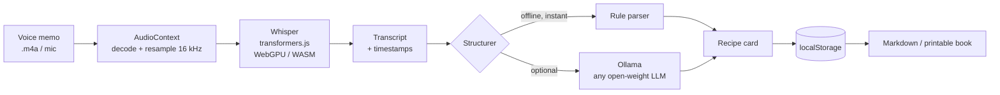

*This is a submission for the [Hacktoberfest Weekend Challenge: Build for a Friend](https://dev.to/challenges/hacktoberfest-weekend-2026-10-01)*

## What I Built

**Nani's Kitchen** turns a grandparent's rambling voice memos into a printable family recipe book. It runs entirely in a browser tab. No server, no API key, no account, no upload.

I built it for **[FRIEND'S NAME]**, my grandmother. She has never written a recipe down in her life. What she does is send four-minute WhatsApp voice notes that open with "okay so today I am going to make" and close with an unrelated story about the coal fire.

Those memos *are* the recipes. They are also the only copy, sitting in a chat backup, one phone replacement away from gone.

Drop a memo in, get back a recipe card with ingredients, method, and the part I actually care about: a section called **In her words** that keeps the stories instead of deleting them.

## Demo

**🔗 [nanis-kitchen.vercel.app](https://nanis-kitchen.vercel.app)**
Mirror: [vanshajpoonia.github.io/nanis-kitchen](https://vanshajpoonia.github.io/nanis-kitchen/)

No sign-up. Load a model, then press **Use the sample memo** if you have no microphone handy — it drops in a real spoken aloo paratha transcript so you can see the structuring without recording anything.

Watch for the little ▶ buttons on each line. Whisper returns timestamps, so every ingredient and every step replays the exact second she said it. The transcript is a convenience; her voice is the source of truth, and I did not want the app to quietly swap one for the other.

## Code



MIT. Static files, no build step, no runtime dependencies.

## How I Built It

**Whisper** — open weights from OpenAI, Apache-2.0 — running in the tab through [transformers.js](https://github.com/huggingface/transformers.js). WebGPU where the browser has it, CPU/WASM everywhere else, picked at runtime.



The interesting file is not the ASR, it is `src/recipe.js`. **Spoken recipes and written recipes are different languages**, and every recipe parser I could find assumes the written one. Nobody says "250 g all-purpose flour". They say "about two cups of maida, maybe a bit more if the dough feels dry". So the parser had to learn a few things:

- **Vague stays vague.** "A pinch", "plenty of ghee, do not be shy with it". Converting those to numbers would be inventing data and would make the book worse.
- **Bare counts are ingredients.** "Also four potatoes, medium size, boiled" has no unit anywhere in it, but it is obviously a shopping line, not an instruction.
- **Descriptors belong to the line above.** That same sentence must not become three ingredients called *four potatoes*, *medium size* and *boiled*.
- **"And then" is a sentence boundary.** "Knead it and then cover it" is two steps. My first attempt produced a cooking step that was just the word **"And"**, which is how I learned to stop re-scanning a string I had already matched.
- **Memories are not instructions, and must not be deleted.** "When I was a girl we had no gas, only the coal fire" is the reason you want the book at all.

There are 16 checks in `tests/run.mjs` covering exactly those cases. They run offline in milliseconds, because the parser is pure functions with no model in it.

There is also an optional path: if **Ollama** is running, the app finds it, lists whatever open-weight models you have pulled, and uses one instead of the rule parser. Swap `llama3.2` for `gpt-oss` for `qwen2.5` and nothing else changes.

## Why Does Open Innovation Matter?

Three answers, in increasing order of how much I actually believe them.

**The easy one: cost.** Transcribing a few hundred old memos through a hosted ASR API is a real bill for something that should be a weekend favour for your family. Here it is zero, permanently.

**The better one: it works on the machine it needs to work on.** This is going to live on an old laptop in my parents' house, offline half the time. `whisper-tiny.en` is 40 MB and runs instantly on hardware like that; `whisper-small.en` is six times bigger and much better at accented English. The right trade-off differs per machine, so it is a dropdown rather than a decision I made for everyone. A closed API gives you whichever model the vendor is serving this quarter.

**The one that actually drove the build: uploading a recording of your grandmother is a thing you do exactly once without thinking about it.** That audio is her voice, her house, her health, whatever else was audible in the room, and often a language a cloud vendor charges a premium for. With a closed API, "it's private" is a sentence in a terms-of-service document that can be revised. With open weights running in `AudioContext` and WASM, it is a property of where the code runs — and you can confirm it by opening the Network tab and finding no request to inspect, because there is no request.

Open innovation did not make this *cheaper* than the closed version. It made a promise checkable that would otherwise have stayed a promise.

## My Agent Session

No DevRelay session on this one, so here is the trail instead: the [commit history](https://github.com/VanshajPoonia/nanis-kitchen/commits/main) and the test suite.

The parser was not designed up front, it was argued with. Every rule above exists because a test failed first, and `tests/run.mjs` reads as a changelog of everything I got wrong about how people talk about food:

```bash
git clone https://github.com/VanshajPoonia/nanis-kitchen
cd nanis-kitchen && npm test
```

16 checks, no model, no network. The one I am fondest of is `no step is a lone conjunction`.

## Prize Categories

<!-- List the partner categories you are entering, or delete this section. -->
