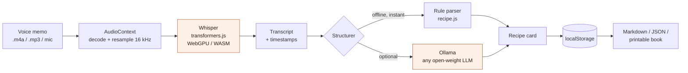

# Nani's Kitchen 🍲

**Turn a grandparent's voice memos into a printable family recipe book. Entirely on your own laptop.**

My grandmother does not write recipes down. She has never written one down. What she does is send
four-minute WhatsApp voice notes that start with "okay so today I am going to make" and end with an
unrelated story about the coal fire. Those memos are the recipes. They are also the only copy.

Nani's Kitchen takes those memos, transcribes them with **Whisper running inside the browser tab**,
pulls out ingredients, method and the stories, and builds a recipe book you can print and hand over.

No server. No API key. No account. The audio never leaves the machine.

---

## Why it had to be open

This is the part that is not a technicality.

Uploading a recording of your grandmother to somebody's inference API is a thing you only do once
without thinking about it. The audio is her voice, her house, her health, whatever else is audible in
the background, and often a language she speaks and a cloud ASR vendor charges extra for. A closed
API makes "it is private" a promise in a terms-of-service document. Open weights make it a property
of where the code runs.

Concretely, open innovation bought four things here:

| | Closed API | This |
|---|---|---|
| **Where the audio goes** | Someone's bucket | `AudioContext` → WASM/WebGPU in the tab |
| **Cost for 200 memos** | Per-minute billing | Zero, forever |
| **Offline** | No | Yes, after the first model download |
| **Swapping the brain** | Whatever the vendor ships | tiny / base / small, or any Ollama model |

The model-swap row is the one that mattered during the build. `whisper-tiny.en` is 40 MB and runs
instantly on an old laptop, which is the machine this will actually live on. `whisper-small.en` is six
times bigger and noticeably better at accented English. You pick per-machine, at runtime, from a
dropdown. No closed API lets you make that trade yourself.

---

## What it does

- **Transcribes on-device** — Whisper via `transformers.js`, WebGPU when available, CPU/WASM otherwise.
- **Keeps the timestamps** — every ingredient and every step has a ▶ button that replays the exact
  second she said it. The transcript is a reference; her voice is the source of truth.
- **Separates the story from the method** — spoken recipes are 40% memory. A line like *"when I was a
  girl we had no gas, only the coal fire"* is not an instruction and should not be deleted either.
  It lands in an **In her words** section.
- **Understands spoken quantities** — "a pinch", "plenty of ghee, do not be shy with it", "about two
  cups of atta, that is the wheat flour". Vague stays vague; it is not invented into `250 g`.
- **Two brains, one dropdown** — a deterministic parser that runs offline and instantly, or any
  open-weight LLM you have in Ollama.
- **Exports a real book** — Markdown, JSON, or a print-ready HTML book that becomes a PDF with Cmd-P.

## Architecture



Everything in that diagram runs on the user's machine. The only network call in the entire app is the
one-time model download from the Hugging Face Hub, which the browser then caches.

## Run it

```bash
git clone https://github.com/VanshajPoonia/nanis-kitchen
cd nanis-kitchen
python3 -m http.server 8000
# open http://localhost:8000
```

It is static files. Any web server works, including GitHub Pages. There is no build step and no
`node_modules`.

**Try it without a microphone:** load the model, then hit *Use the sample memo* for a real spoken
transcript of an aloo paratha recipe, and press *Make a recipe card*.

### Tests

```bash
npm test
```

16 checks against a real spoken transcript, covering the cases that are easy to get wrong: bare
counts with no unit ("four potatoes"), descriptors that must stay attached to the line above
("medium size, boiled"), `and then` splitting into two steps without leaving a stray "And", and
memories landing in the story section rather than the method. No model needed; the parser is pure
functions.

### Optional: structure with a local LLM

```bash
brew install ollama
ollama pull llama3.2        # or gpt-oss, qwen2.5, mistral, whatever you like
OLLAMA_ORIGINS=* ollama serve
```

The app probes `localhost:11434`, lists whatever you have pulled, and uses it instead of the rule
parser. `OLLAMA_ORIGINS=*` is needed so the browser is allowed to talk to it.

## Browser support

| | Whisper | Notes |
|---|---|---|
| Chrome / Edge 113+ | WebGPU | Fastest, roughly realtime on `base.en` |
| Safari 17+ | WASM | Works, slower |
| Firefox | WASM | Works, slower |

A two-minute memo on `whisper-base.en` takes about 20 seconds on WebGPU and about 90 on WASM.

## Project layout

```
index.html        single page
assets/styles.css light + dark, no framework
src/asr.js        Whisper pipeline, audio decode, resampling
src/recipe.js     spoken-transcript → structured recipe (the interesting file)
src/ollama.js     optional local LLM path
src/book.js       localStorage + Markdown/HTML/JSON export
src/app.js        UI wiring
```

The parser in `src/recipe.js` is the part worth reading. Written recipes and spoken recipes are
different languages, and almost all recipe-parsing code assumes the written one.

## Honest limitations

- Heavy accents plus kitchen noise will still trip `tiny`. Move up to `small.en`.
- Ingredient splitting is heuristic. A run-on sentence occasionally produces a run-on line, which is
  why the title is editable and the export is plain Markdown you can fix in ten seconds.
- Multilingual memos need the non-`.en` models and are noticeably slower.
- The book lives in `localStorage`. Export it. That is what the export buttons are for.

## License

MIT. The Whisper weights are Apache-2.0 from OpenAI, served via the Hugging Face Hub.
